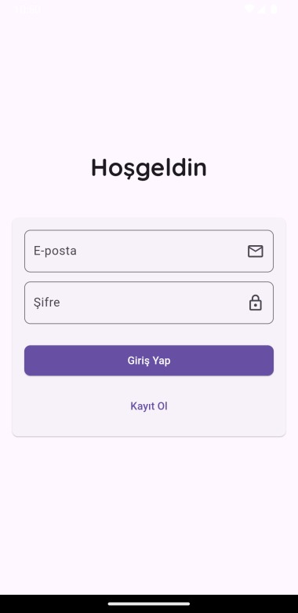
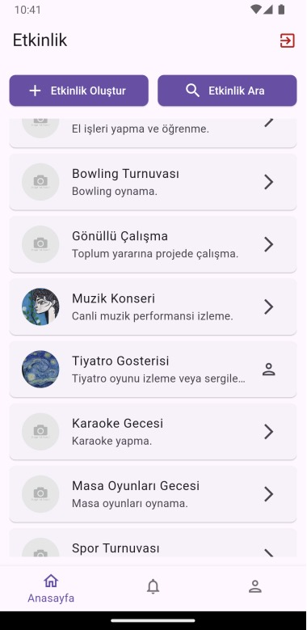
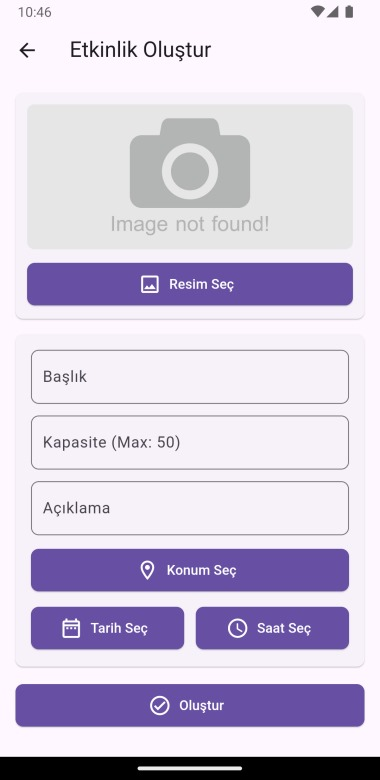
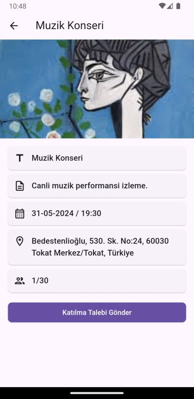
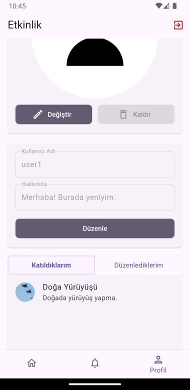
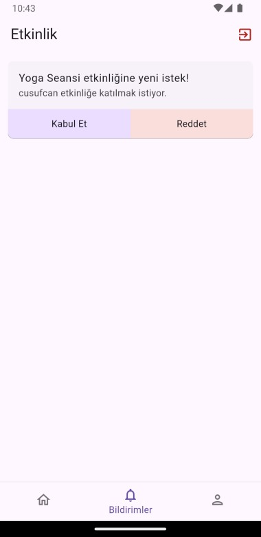

# Etkinlik

+ Bilgisayar Uygulamaları 1 dersi için yaptığım birinci dönemlik proje. Kullanıcılar etkinlik oluşturup başkalarıyla etkileşime girebilir.

## Temel Özellikler:

+ Detayları girilen etkinliği oluşturma.
+ Oluşturulan etkinliklere katılma isteği atma.
+ Gelen etkinlik isteklerini kabul edip reddetme.

## Kurulum:

    git clone https://github.com/cusufcan/etkinlik

## Ekran Görüntüleri:

<table>
    <tr>
        <td></td>
        <td></td>
        <td></td>
    </tr>
    <tr>
        <td></td>
        <td></td>
        <td></td>
    </tr>
</table>

## Kullanılan Teknolojiler:

+ Flutter & Dart
+ Firebase
+ Google Fonts
+ Flutter Riverpod
+ Image Cropper
+ Image Picker
+ Map Location Picker
+ UUID
+ HTTP

## Lisans:

    MIT
